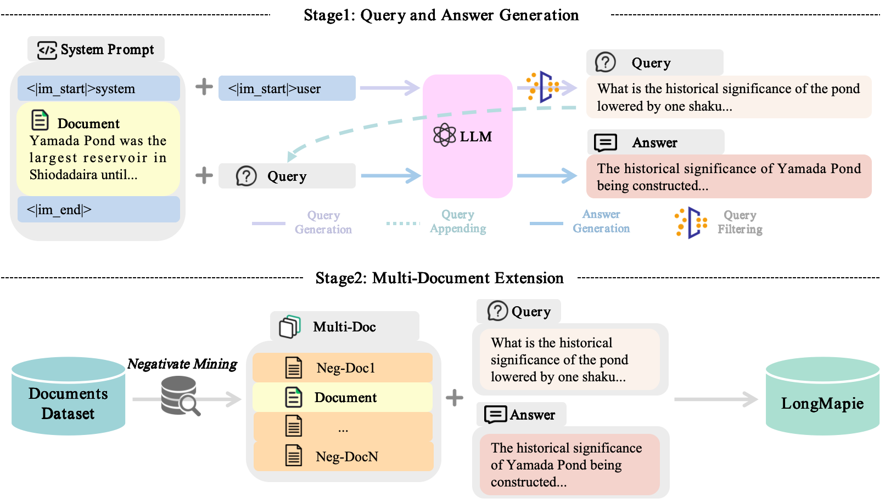

## LongMagpie: A Self-synthesis Method for Generating Large-scale Long-context Instructions

This repository contains the code, models and datasets for our paper [LongMagpie: A Self-synthesis Method for Generating Large-scale Long-context Instructions].


## Quick Links

  - [Overview](#overview)
  - [LongMagpie Models](#LongMagpie-models)
  - [LongMagpie Datasets](#LongMagpie-datasets)
    - [Datasets list](#datasets-list)
  - [Train Llama-3-8B-LongMagpie-512K-Instruct](#train-LongMagpie512K)
    - [Requirements](#requirements)
  - [Evaluation](#evaluation)
  - [Build your long-context instruction data](#build-long-data)
  - [Bugs or Questions?](#bugs-or-questions)


<a id="overview"></a>

## Overview


High-quality long-context instruction data is essential for aligning long-context large language models (LLMs). Despite the public release of models like Qwen and Llama, their long-context instruction data remains proprietary. Human annotation is costly and challenging, while template-based synthesis methods limit scale, diversity, and quality. We introduce LongMagpie, a self-synthesis framework that automatically generates large-scale long-context instruction data. Our key insight is that aligned long-context LLMs, when presented with a document followed by special tokens preceding a user turn, auto-regressively generate contextually relevant queries. By harvesting these document-query pairs and the model's responses, LongMagpie produces high-quality instructions without human effort. Experiments on HELMET, RULER, and Longbench v2 demonstrate that LongMagpie achieves leading performance on long-context tasks while maintaining competitive performance on short-context tasks, establishing it as a simple and effective approach for open, diverse, and scalable long-context instruction data synthesis.

<div style="text-align: center;">
  
</div>

<a id="LongMagpie-models"></a>

## LongMagpie Models

Our released models are listed as follows. You can import these models by using [HuggingFace's Transformers](https://github.com/huggingface/transformers). All models are trained on long-context instruction data synthesized by [fineweb-edu](https://huggingface.co/datasets/HuggingFaceFW/fineweb-edu) and [Qwen/Qwen2.5-72B-Instruct](https://huggingface.co/Qwen/Qwen2.5-72B-Instruct) model. In the following comparision, we choose [Llama-3-8B-NExtLong-512K-Instruct](https://huggingface.co/caskcsg/Llama-3-8B-NExtLong-512K-Instruct) as a baseline model, which is trained with [Magpie instruction data](https://huggingface.co/datasets/Magpie-Align/Magpie-Llama-3.3-Pro-1M-v0.1). In addition, to maintain short-text performance, we propose a p-mix strategy that combines LongMagpie and [UltraChat](https://huggingface.co/datasets/stingning/ultrachat) datasets, resulting in a performance-balanced model [Llama-3-8B-LongMagpie-p-mix-512K-Instruct](https://huggingface.co/caskcsg/Llama-3-8B-LongMagpie-512K-Instruct).


#### The performance on [HELMET](https://github.com/princeton-nlp/HELMET) and [RULER](https://github.com/NVIDIA/RULER)

|              Model              |  RULER Avg.  |  HELMET Avg.  | HELMET Recall | HELMET RAG  | HELMET ICL  | HELMET Re-rank | HELMET LongQA |
|:-------------------------------|:-------:|:-------:|:------:|:-----:|:-----:|:-------:|:------:|
| [Llama-3-8B-NExtLong-512K-Instruct](https://huggingface.co/caskcsg/Llama-3-8B-NExtLong-512K-Instruct) | 88.00 | 59.92 | **98.63** | 	62.70 | 	81.00 | 	26.41 | 	30.89  |
| [Llama-3-8B-LongMagpie-512K-Instruct](https://huggingface.co/caskcsg/Llama-3-8B-LongMagpie-512K-Instruct) | **91.17** | 62.10 | 97.53 | 63.37 | **85.84** | 28.60 | 35.16 |
| [Llama-3-8B-LongMagpie-p-mix-512K-Instruct](https://huggingface.co/caskcsg/Llama-3-8B-LongMagpie-p-mix-512K-Instruct) | 89.70 | **62.11** | 95.96  |	**64.17** |	85.12 |	**29.61** |	**35.71** |


#### The performance on [Longbench V2](https://github.com/THUDM/LongBench)

| Model                                      | Overall (%) | Easy (%) | Hard (%) | Short (%) | Medium (%) | Long (%) |
|--------------------------------------------|-------------|----------|----------|-----------|------------|----------|
| [Llama-3-8B-NExtLong-512K-Instruct](https://huggingface.co/caskcsg/Llama-3-8B-NExtLong-512K-Instruct)          | 30.8        | 33.9     | 28.9     | 37.8      | 27.4       | **25.9**     |
| [Llama-3-8B-LongMagpie-512K-Instruct](https://huggingface.co/caskcsg/Llama-3-8B-LongMagpie-512K-Instruct)          | **34.4**|	**38.5**	|**31.8**|	**41.7**	|33	|25    |
| [Llama-3-8B-LongMagpie-p-mix-512K-Instruct](https://huggingface.co/caskcsg/Llama-3-8B-LongMagpie-p-mix-512K-Instruct)           | 33 |	35.9	|31.2	|37.2	|**34.9**|	22.2     |


#### The performance on Short-context Benchmarks


| Model                      | Avg.   | Hel. | Lam. | AR-C. | AR-E. | PIQA  | Win. | Logiqa | MMLU  |
|----------------------------|-------|-----------|----------------|---------------|----------|-------|------------|--------|-------|
| [Meta-Llama-3-8B-Instruct](https://huggingface.co/meta-llama/Meta-Llama-3-8B-Instruct)   | 0.6332 | 0.5773    | 0.7171         | 0.5316        | 0.8165   | 0.7889 | 0.7198     | 0.2765 | 0.6376 |
| [Llama-3-8B-NExtLong-512K-Instruct](https://huggingface.co/caskcsg/Llama-3-8B-NExtLong-512K-Instruct) | **0.6410** | **0.5953**    | 0.7242         | 0.5188        | 0.8224   | **0.8079** | 0.7324     | **0.3041** | 0.6232 |
| [Llama-3-8B-LongMagpie-512K-Instruct](https://huggingface.co/caskcsg/Llama-3-8B-LongMagpie-512K-Instruct) | 0.6237	|0.5803	|0.7025	|0.4804|	0.8047|	0.7938	|0.7293|	0.278	|0.6209 |
| [Llama-3-8B-LongMagpie-p-mix-512K-Instruct](https://huggingface.co/caskcsg/Llama-3-8B-LongMagpie-p-mix-512K-Instruct) | **0.6410** |	0.5893 |	**0.7355**|	**0.5282**|	**0.8279**|	0.8052|	**0.734**|	0.2842|	**0.6236** |


<a id="LongMagpie-datasets"></a>

## LongMagpie Datasets

<a id="datasets-list"></a>

### Datasets list

Our released datasets are listed as follows. All datasets are synthesized from the short-text datasets [fineweb-edu](https://huggingface.co/datasets/HuggingFaceFW/fineweb-edu).


|              Dataset              | Description | 
|:-------------------------------|:--------|
| [LongMagpie_singledoc_longcontext_dataset](https://huggingface.co/datasets/caskcsg/LongMagpie_singledoc_longcontext_dataset) | Our synthesized 450k raw text files(refer to [infer_demo.py](https://github.com/caskcsg/longcontext/tree/main/LongMagpie/longmagpie/infer_demo.py)). Each line of data contains context extracted from [fineweb-edu](https://huggingface.co/datasets/HuggingFaceFW/fineweb-edu), query generated by LongMapgie and answer. |
| [LongMagpie_multidoc_longcontext_dataset](https://huggingface.co/datasets/caskcsg/LongMagpie_multidoc_longcontext_dataset) | Based on [LongMagpie_singledoc_longcontext_dataset](https://huggingface.co/datasets/caskcsg/LongMagpie_singledoc_longcontext_dataset), we used the MultiDoc method (refer to [multidoc_format.py](https://github.com/caskcsg/longcontext/tree/main/LongMagpie/longmagpie/multidoc_format.py)) to extend the context length and transformed it into SFT dialogue format. |
| [LongMagpie_64k_dataset](https://huggingface.co/datasets/caskcsg/LongMagpie_64k_dataset) | We tokenized [LongMagpie_multidoc_longcontext_dataset](https://huggingface.co/datasets/caskcsg/LongMagpie_multidoc_longcontext_dataset) and concatenated it to a length of 64k (refer to [concat script](https://github.com/caskcsg/longcontext/tree/main/LongMagpie/longmagpie/build_sft_data.py)), making it convenient to train using Document Mask technology. This dataset can be used to achieve the best long-text performance. |
| [LongMagpie_p-mix_64k_dataset](https://huggingface.co/datasets/caskcsg/LongMagpie_p-mix_64k_dataset) | To maintain short-text performance, we tokenized [LongMagpie_multidoc_longcontext_dataset](https://huggingface.co/datasets/caskcsg/LongMagpie_multidoc_longcontext_dataset) and mixed it with [UltraChat](https://huggingface.co/datasets/stingning/ultrachat) using the p-mix strategy, concatenating to a length of 64k (refer to [p-mix.py](https://github.com/caskcsg/longcontext/tree/main/LongMagpie/longmagpie/build_sft_data_p_mix.py)). This dataset can be used to achieve balanced long and short text performance. |


<a id="train-LongMagpie512K"></a>

## Train Llama-3-8B-LongMagpie-512K-Instruct

<a id="requirements"></a>

### Requirements

Run the following script to install the remaining dependencies and train the model.

```bash
pip install -r requirements.txt
```

### Train

```bash
bash train_sft.sh
```


<a id="evaluation"></a>

## Evaluation

Refer to the [HELMET](https://github.com/princeton-nlp/HELMET), [RULER](https://github.com/NVIDIA/RULER), and [Longbench V2](https://github.com/THUDM/LongBench) to evaluate the Instruct model.


<a id="build-long-data"></a>

## Build your long-context instruction data


### 1. Synthesizing Single-Document Q&A Data

Refer to [infer_demo.py](https://github.com/caskcsg/longcontext/tree/main/LongMagpie/longmagpie/infer_demo.py). Each line of data contains context extracted from [fineweb-edu](https://huggingface.co/datasets/HuggingFaceFW/fineweb-edu), query generated by LongMapgie and answer.


```bash
python longmagpie/infer_demo.py
```

### 2. Synthesizing Multi-Document Q&A Data

Based on [LongMagpie_singledoc_longcontext_dataset](https://huggingface.co/datasets/caskcsg/LongMagpie_singledoc_longcontext_dataset), we used the MultiDoc method (refer to [multidoc_format.py](https://github.com/caskcsg/longcontext/tree/main/LongMagpie/longmagpie/multidoc_format.py)) to extend the context length and transformed it into SFT dialogue format.

```bash
python longmagpie/multidoc_format.py
```


### 3. Dataset Concatenation

Following [ProLong](https://github.com/princeton-nlp/ProLong), we concatenate the datasets to a fixed 64k context length and train using Document Mask technology.

#### 3.1 Concatenating Document Q&A Datasets Only

We tokenized [LongMagpie_multidoc_longcontext_dataset](https://huggingface.co/datasets/caskcsg/LongMagpie_multidoc_longcontext_dataset) and concatenated it to a length of 64k (refer to [build_sft_data.py](https://github.com/caskcsg/longcontext/tree/main/LongMagpie/longmagpie/build_sft_data.py)), making it convenient to train using Document Mask technology. This dataset can be used to achieve the best long-text performance.

```bash
python longmagpie/build_sft_data.py
```

#### 3.2 Using p-mix Strategy

To balance these capabilities, we introduce \textit{p}-Mix, a novel instruction data hybridization strategy. The core idea is twofold. First, to emulate the typical non-contextual start of general tasks, we sample a short-context instruction at the beginning of each training sequence. Second, we append subsequent data segments probabilistically to construct a mixed-context sequence up to length $L_{max}$. With probability $P_L$, a long-context instruction (generated by LongMagpie) is chosen; otherwise, with probability $1-P_L$, another short-context sample is chosen. This process repeats until approaching the target sequence length, ensuring each instance starts with a short, context-free instruction followed by a dynamically mixed sequence of long and short segments.

```bash
python longmagpie/build_sft_data_p_mix.py
```


<a id="bugs-or-questions"></a>

## Bugs or questions?

If you have any questions related to the code or the paper, feel free to email Chaochen (`gaochaochen@iie.ac.cn`) and XingWu (`wuxing@iie.ac.cn`). If you encounter any problems when using the code, or want to report a bug, you can open an issue. Please try to specify the problem with details so we can help you better and quicker!

<!-- ## Citation

Please cite our paper if you use LongMagpie in your work:

```bibtex

``` -->