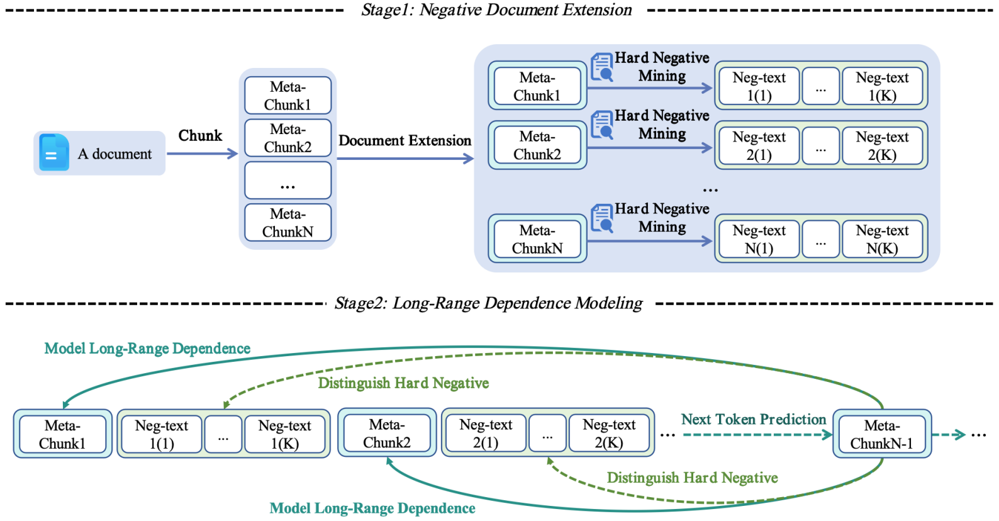

## NExtLong: Toward Effective Long-Context Training without Long Documents

This repository contains the code ,models and datasets for our paper [NExtLong: Toward Effective Long-Context Training without Long Documents](https://arxiv.org/pdf/2501.12766).


## Quick Links

  - [Overview](#overview)
  - [NExtLong Models](#NExtLong-models)
  - [NExtLong Datasets](#NExtLong-datasets)
    - [Datasets list](#datasets-list)
    - [How to use NExtLong datasets](#dataset-use)
  - [Train Llama-3-8B-NExtLong-512K-Base](#train-nextlong512K)
    - [Requirements](#requirements)
    - [Two-stage Long-Context Training](#two-stage-long-context-training)
  - [Train Llama-3-8B-NExtLong-512K-Instruct](#train-nextlong512Kins)
  - [Train Llama-3-8B-NExtLong-128K-Base](#train-nextlong128K)
  - [Evaluation](#evaluation)
  - [Build your long-context data](#build-long-data)
    - [Build faiss index](#build-faiss-index)
    - [Long-context data synthesis](#data-synthesis)
  - [Bugs or Questions?](#bugs-or-questions)


<a id="overview"></a>

## Overview


Large language models (LLMs) with extended context windows have made significant strides yet remain a challenge due to the scarcity of long documents. Existing methods tend to synthesize long-context data but lack a clear mechanism to reinforce the long-range dependency modeling. To address this limitation, we propose NExtLong, a novel framework for synthesizing long-context data through Negative document Extension. NExtLong decomposes a document into multiple meta-chunks and extends the context by interleaving hard negative distractors retrieved from pretraining corpora. This approach compels the model to discriminate long-range dependent context from distracting content, enhancing its ability to model long-range dependencies. Extensive experiments demonstrate that NExtLong achieves significant performance improvements on the HELMET and RULER benchmarks compared to existing long-context synthesis approaches and leading models, which are trained on non-synthetic long documents.  
<div style="text-align: center;">
  
</div>

<a id="NExtLong-models"></a>

## NExtLong Models

### Long-context Benchmarks
Our released models are listed as follows. You can import these models by using [HuggingFace's Transformers](https://github.com/huggingface/transformers). All models are trained on long-context data synthesized by [Fineweb-edu](https://huggingface.co/datasets/HuggingFaceFW/fineweb-edu) and [Cosmopedia v2](https://huggingface.co/datasets/HuggingFaceTB/smollm-corpus).

|              Model              |  Avg.  | Recall |  RAG  |  ICL  | Re-rank | LongQA |  RULER  |
|:-------------------------------|:-------:|:------:|:-----:|:-----:|:-------:|:------:|:-------:|
| [Llama-3-8B-NExtLong-128K-Base](https://huggingface.co/caskcsg/Llama-3-8B-NExtLong-128K-Base) | 62.58 | 82.56 | 60.91 | 81.76 | 31.47 | 37.30 | 81.50 |
| [Llama-3-8B-NExtLong-512K-Base](https://huggingface.co/caskcsg/Llama-3-8B-NExtLong-512K-Base) | 65.76 | 91.58 | 63.68 | 84.08 | 31.27 | 38.42 | 85.52 |

We released our Instruct model, which is based on our Llama-3-8B-NExtLong-512K-Base model, fine-tuned using the [Magpie-Align/Magpie-Llama-3.3-Pro-1M-v0.1](https://huggingface.co/caskcsg/Llama-3-8B-NExtLong-512K-Base) dataset. We evaluated our model on the Longbench V2 benchmark and achieved the top ranking (2025-01-23) among models of the comparable size (under 10B).


| Model                                      | Overall (%) | Easy (%) | Hard (%) | Short (%) | Medium (%) | Long (%) |
|--------------------------------------------|-------------|----------|----------|-----------|------------|----------|
| [Llama-3-8B-NExtLong-512K-Instruct](https://huggingface.co/caskcsg/Llama-3-8B-NExtLong-512K-Instruct)          | 30.8        | 33.9     | 28.9     | 37.8      | 27.4       | 25.9     |
| [Llama-3-8B-NExtLong-512K-Instruct](https://huggingface.co/caskcsg/Llama-3-8B-NExtLong-512K-Instruct) + cot    | 32          | 36.5     | 29.3     | 37.2      | 31.2       | 25       |

In addition, fine-tuning using the [ultrachat](https://huggingface.co/datasets/stingning/ultrachat) dataset can also yield good results, as we reported in Section 5.2 of the [NExtLong paper](https://arxiv.org/pdf/2501.12766).


### Short-context Benchmarks


| Model                      | Avg.   | Hel. | Lam. | AR-C. | AR-E. | PIQA  | Win. | Logiqa | MMLU  |
|----------------------------|-------|-----------|----------------|---------------|----------|-------|------------|--------|-------|
| [Meta-Llama-3-8B-Instruct](https://huggingface.co/meta-llama/Meta-Llama-3-8B-Instruct)   | 0.6332 | 0.5773    | 0.7171         | 0.5316        | 0.8165   | 0.7889 | 0.7198     | 0.2765 | 0.6376 |
| [Llama-3-8B-NExtLong-512K-Instruct](https://huggingface.co/caskcsg/Llama-3-8B-NExtLong-512K-Instruct) | 0.6410 | 0.5953    | 0.7242         | 0.5188        | 0.8224   | 0.8079 | 0.7324     | 0.3041 | 0.6232 |

Comparing with Meta-Llama-3-8B-Instruct, NextLong-Llama-3-8B-Instruct shows no degradation on the short-context benchmarks.


<a id="NExtLong-datasets"></a>

## NExtLong Datasets

<a id="datasets-list"></a>

### Datasets list

Our released datasets are listed as follows. All datasets are synthesized from the short-text datasets [Fineweb-edu](https://huggingface.co/datasets/HuggingFaceFW/fineweb-edu) and [Cosmopedia v2](https://huggingface.co/datasets/HuggingFaceTB/smollm-corpus).


|              Dataset              | Description | 
|:-------------------------------|:--------|
| [NExtLong-64K-dataset](https://huggingface.co/datasets/caskcsg/NExtLong-64K-dataset) |   Completely composed of 64K synthetic data. |
| [NExtLong-512K-dataset](https://huggingface.co/datasets/caskcsg/NExtLong-512K-dataset) |   Completely composed of 512K synthetic data. |
| [NExtLong-128K-dataset](https://huggingface.co/datasets/caskcsg/NExtLong-128K-dataset) |  Completely composed of 128K synthetic data. The NExtLong-128K-dataset is used to produce the Llama-3-8B-NExtLong-128K-Base model. |
| [NExtLong-512K-dataset-subset](https://huggingface.co/datasets/caskcsg/NExtLong-512K-dataset-subset) |   A subset randomly selected from the NExtLong-64K-dataset and NExtLong-512K-dataset. It is used to produce the Llama-3-8B-NExtLong-512K-Base model.|
| [NExtLong-Instruct-dataset-Magpie-Llama-3.3-Pro-1M-v0.1](https://huggingface.co/datasets/caskcsg/NExtLong-Instruct-dataset-Magpie-Llama-3.3-Pro-1M-v0.1) |   We transformed the [Magpie-Align/Magpie-Llama-3.3-Pro-1M-v0.1](https://huggingface.co/datasets/Magpie-Align/Magpie-Llama-3.3-Pro-1M-v0.1) dataset and produce the Llama-3-8B-NExtLong-512K-Instruct model.|

<a id="dataset-use"></a>

### How to use NExtLong datasets

1. Due to differences in model tokenizers, the number of tokens after encoding each piece of data may not meet expectations. Therefore, for data that exceeds the target length after tokenization, truncation is necessary. Additionally, a small portion of the data may fall short of the target length and should be discarded.

2. Given the abundance of data, we recommend discarding data that does not meet the target length or using document mask techniques for concatenation. The implementation of document mask can be referenced in [ProLong](https://github.com/princeton-nlp/ProLong). If document mask is not used, please avoid randomly concatenating such data.

3. Since our data is solely sourced from fineweb-edu and Cosmopedia v2, we recommend using 4B NExtLong data for long context training. If a larger volume of data is desired for training, it is advisable to incorporate more data sources to prevent the model from overfitting to these two datasets.


<a id="train-nextlong512K"></a>

## Train Llama-3-8B-NExtLong-512K-Base


<a id="requirements"></a>

### Requirements

Run the following script to install the remaining dependencies.

```bash
pip install -r requirements.txt
```

<a id="two-stage-long-context-training"></a>

### Two-stage Long-Context Training


The training of Llama-3-8B-NExtLong-512K-Base is divided into two stages. In the first stage, we trained a 64K model. Considering that 64K-length data is not scarce, we directly used the [ProLong](https://github.com/princeton-nlp/ProLong) dataset, following the training settings of ProLong. However, we retrained the model without using Llama-3-8B-ProLong-64k-Base for warm-start, as we could load more parameters from the optimizer.bin saved in the first stage. Of course, you can also use [Llama-3-8B-ProLong-64k-Base](https://huggingface.co/princeton-nlp/Llama-3-8B-ProLong-64k-Base) for warm-start, but this might result in some performance degradation. After downloading the ProLong data, you can use the following script to perform the first stage of training.

```bash
bash train_64K.sh
```


In the second stage, we utilized the [NExtLong-512K-dataset-subset](https://huggingface.co/datasets/caskcsg/NExtLong-512K-dataset-subset) to extend the model's context length from 64K to 512K. We provided the dataset in streaming format, which can be directly used for training. For other datasets, you can convert them into streaming format using the [datatools](https://github.com/CodeCreator/datatools). For 64K datasets, it is necessary to pack them to a length of 512K. Simply modify the warm-start model in train_512K.sh and then run the script directly.

```bash
bash train_512K.sh
```

<a id="train-nextlong512Kins"></a>

## Train Llama-3-8B-NExtLong-512K-Instruct

We utilized the [Magpie-Align/Magpie-Llama-3.3-Pro-1M-v0.1](https://huggingface.co/caskcsg/Llama-3-8B-NExtLong-512K-Base) dataset to fine-tune the Llama-3-8B-NExtLong-512K-Base model. The dataset was converted into streaming format and open-sourced as [NExtLong-Instruct-dataset-Magpie-Llama-3.3-Pro-1M-v0.1](https://huggingface.co/caskcsg/Llama-3-8B-NExtLong-512K-Base).


```bash
bash train_sft.sh
```


<a id="train-nextlong128K"></a>


## Train Llama-3-8B-NExtLong-128K-Base Model

During the training of the 128K model, we directly warm-started from [Meta-Llama-3-8B](https://huggingface.co/meta-llama/Meta-Llama-3-8B) and conducted a single-stage training using only the [NExtLong-128K-dataset](https://huggingface.co/datasets/caskcsg/NExtLong-128K-dataset). Our code is adapted from [gpt-neox](https://github.com/EleutherAI/gpt-neox) and will be open-sourced in the future. It is also likely that using Prolong's code directly for training could achieve the desired results.


<a id="evaluation"></a>

## Evaluation

Refer to the [HELMET](https://github.com/princeton-nlp/HELMET) Benchmark to evaluate pre-trained models, and use [Longbench V2](https://github.com/THUDM/LongBench) to evaluate the Instruct model.


<a id="build-long-data"></a>

## Build your long-context data

<a id="build-faiss-index"></a>

### 1. Build faiss index

Refer to [faiss demos](https://github.com/facebookresearch/faiss/tree/main/demos/offline_ivf) and [in-context-pretraining](https://github.com/swj0419/in-context-pretraining) to build a faiss index. Before generating embeddings, we use our chunking algorithm to split each document and add each chunk individually to the faiss index. We use [jina-embeddings-v3](https://huggingface.co/jinaai/jina-embeddings-v3) to generate embeddings. The chunking code is shown in chunking.py, and we will provide more detailed code later.


<a id="data-synthesis"></a>

### 2. Long-context data synthesis

Once the FAISS library is established, the synthesis can be carried out directly using the pseudocode outlined in Appendix C.2 of the NExtLong paper. We will provide more comprehensive code to complement this.


<a id="bugs-or-questions"></a>

## Bugs or questions?

If you have any questions related to the code or the paper, feel free to email Chaochen (`gaochaochen@iie.ac.cn`) and XingWu (`wuxing@iie.ac.cn`). If you encounter any problems when using the code, or want to report a bug, you can open an issue. Please try to specify the problem with details so we can help you better and quicker!

<!-- ## Citation

Please cite our paper if you use NExtLong in your work:

```bibtex

``` -->